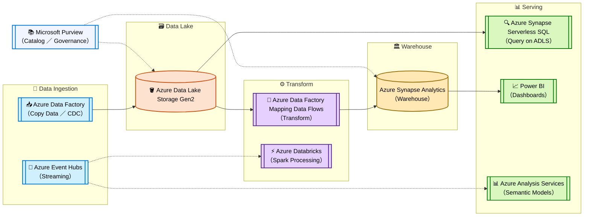
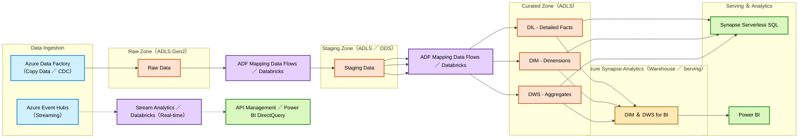
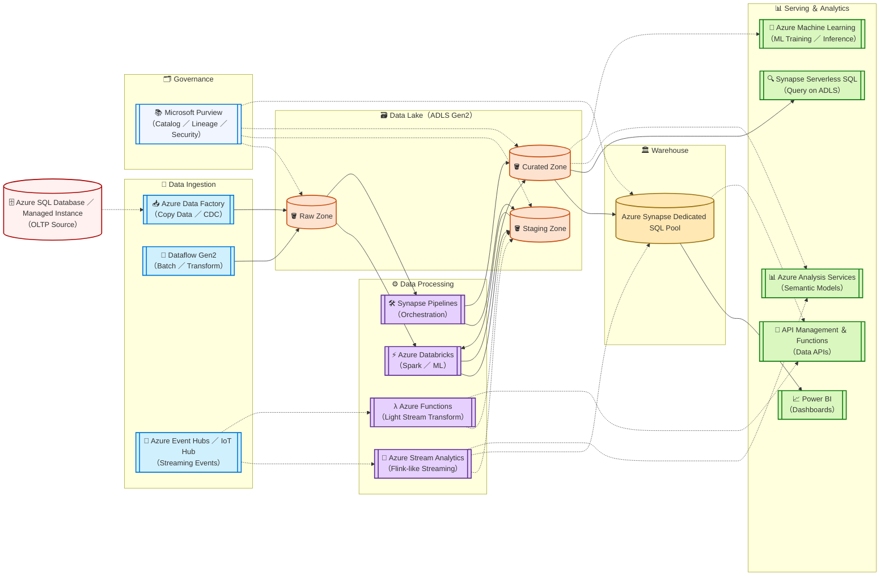

# 📦 Azure Data Engineering Overview

> 📚 Motivation: Data without architecture is just noise；architect it well，and it becomes knowledge.

🌅 **Microsoft Certified：Azure Data Engineer Associate（DP‑203）**

## Preface

In modern data architecture，**Azure** provides a comprehensive set of tools to support the **full data lifecycle** —— from ingestion and storage to processing，orchestration，governance，and serving。

> Solid line → main path（core data flow），Dashed line → optional／supplementary path；CDC：Change Data Capture

---

## 1）Simple Version

---

## 2）Middle Version

---

## 3）Detailed Version

---

## Azure Zones Definition

1. **Raw Zone（ADLS Gen2）**  
   - Exact copy of source data（immutable）。  
   - For audit and reprocessing。  

2. **Staging Zone（ADLS Gen2 ／ ODS）**  
   - Lightly cleaned，standardized schema。  
   - Temporary before transformation。  

3. **Curated Zone（ADLS ／ Synapse）**  
   - **DIL**：detailed，cleaned facts。  
   - **DIM**：dimensions for joins。  
   - **DWS**：aggregated，business‑ready tables。  
   - Stored in ADLS for Serverless SQL or in Synapse for high performance。  

4. **Synapse Analytics**  
   - Stores DIM／DWS for fast BI queries。  
   - Powers dashboards，APIs，and advanced analytics。  

---

## AWS → Azure Service Comparison Table (Concise Version)

| Function                      | AWS                                               | Azure                                                              |
| ----------------------------- | ------------------------------------------------- | ------------------------------------------------------------------ |
| Batch ingestion/orchestration | AWS Glue Ingest / Glue Workflows / Step Functions | Azure Data Factory / Synapse Pipelines                             |
| CDC (database replication)    | AWS DMS                                           | ADF Change Data Capture (SQL/MI) / third-party (Debezium/Fivetran) |
| Streaming ingestion           | Amazon Kinesis / MSK                              | Azure Event Hubs / IoT Hub                                         |
| Stream processing             | Kinesis Data Analytics (Flink)                    | Azure Stream Analytics / Databricks Structured Streaming           |
| Data lake storage             | Amazon S3                                         | Azure Data Lake Storage Gen2                                       |
| Batch processing engine       | AWS Glue ETL (Spark) / EMR                        | Azure Databricks / ADF Mapping Data Flows                          |
| Metadata catalog              | AWS Glue Data Catalog                             | Microsoft Purview                                                  |
| Data warehouse                | Amazon Redshift                                   | Azure Synapse Dedicated SQL Pool                                   |
| Lakehouse ad-hoc queries      | Amazon Athena                                     | Synapse Serverless SQL                                             |
| Search / logging              | Amazon OpenSearch                                 | Azure Cognitive Search / Log Analytics                             |
| Visualization                 | Amazon QuickSight                                 | Power BI                                                           |
| Machine learning              | Amazon SageMaker                                  | Azure Machine Learning                                             |
| API exposure                  | API Gateway & Lambda                              | API Management & Functions                                         |

---

## Synapse vs Hive vs Databricks SQL

| Feature | Synapse Dedicated SQL Pool | Hive | Databricks SQL |
|--------|-----------------------------|------|----------------|
| Type | Managed MPP Data Warehouse | Hadoop SQL Engine | Spark‑based SQL |
| Storage | Internal columnar store | HDFS | HDFS ／ ADLS ／ S3 |
| Latency | Fast | Slow | Fast |
| Deployment | Fully managed | Self‑hosted Hadoop | Managed ／ Serverless |
| Best for | BI star／snowflake，ELT，materialized data marts | Legacy batch ETL | Interactive lakehouse BI，SQL endpoints |

---

### Notes (Practical Tips)

- **Recommended architecture**: ADLS (Raw → Staging → Curated) + Databricks (Transform) + Synapse (Serving) + Purview (Governance) + ADF/Synapse Pipelines (Orchestration).
- **Cost control**: Use Serverless SQL for exploration; use Dedicated SQL Pool only for stable reporting; enable auto-termination for Databricks workspaces.
- **Access governance**: Use Purview as the catalog source, combined with R...

